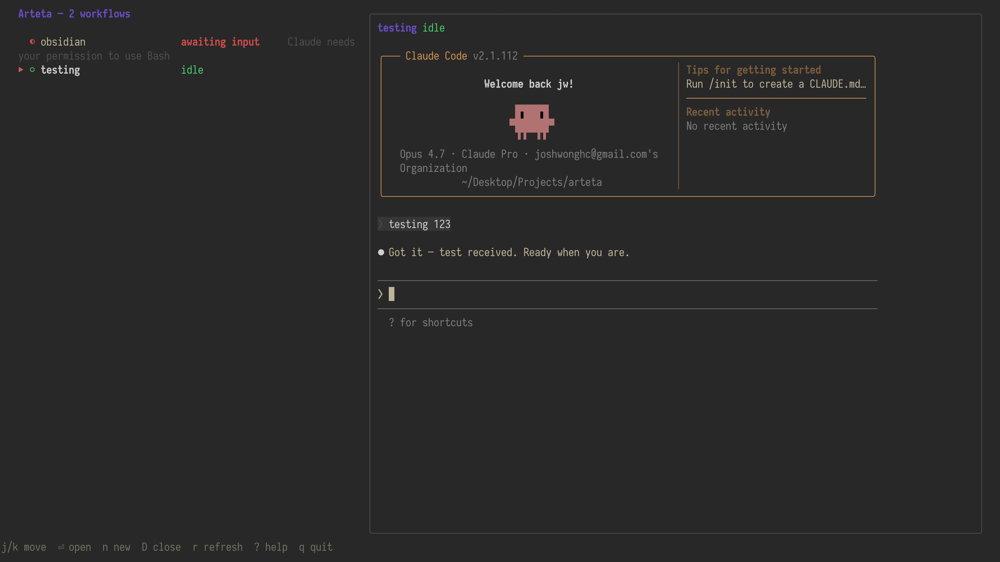

# Arteta

A terminal UI for managing multiple Claude Code sessions across iTerm2 tabs.

Each Claude session ("workflow") gets its own tmux session on a dedicated
socket, its own iTerm tab, and a row on the homepage that surfaces what
Claude is doing right now — running, awaiting input, or idle. Status is
driven by Claude Code hooks, so the homepage updates without polling.



See [SPEC.md](SPEC.md) for the product vision and [DECISIONS.md](DECISIONS.md)
for the design rationale behind the MVP.

## Requirements

- macOS (the iTerm2 adapter uses AppleScript)
- [iTerm2](https://iterm2.com)
- [tmux](https://github.com/tmux/tmux) on `$PATH`
- [Claude Code](https://docs.claude.com/en/docs/claude-code) (`claude` on `$PATH`)
- Go 1.26+ to build from source

## Install

```sh
git clone git@github.com:hcwong/arteta.git
cd arteta
go install ./cmd/arteta
```

This puts `arteta` in `$(go env GOPATH)/bin` (typically `~/go/bin`). If
that directory isn't already on your `$PATH`, add it:

```sh
# zsh / bash — add to ~/.zshrc or ~/.bashrc
export PATH="$(go env GOPATH)/bin:$PATH"
```

Verify with `which arteta`.

Then install the Claude hooks Arteta relies on for live status:

```sh
arteta init
```

`init` is additive and idempotent — it backs up your existing
`~/.claude/settings.json` before writing and only adds entries it can later
identify as its own. To remove them later:

```sh
arteta uninstall
```

To check what's installed:

```sh
arteta doctor
```

## Usage

Launch the homepage:

```sh
arteta
```

### Keybindings

| Key      | Action                                        |
| -------- | --------------------------------------------- |
| `j`/`k`  | Move selection (also `↓`/`↑`)                 |
| `g`/`G`  | Jump to top / bottom                          |
| `⏎`      | Open selected workflow (revive if dormant)    |
| `n`      | New workflow                                  |
| `D`      | Close workflow (with confirm)                 |
| `r`      | Refresh                                       |
| `?`      | Show keybinding help                          |
| `q`      | Quit Arteta (workflows keep running)          |

### Layouts

When creating a workflow you pick one of four pane layouts. The layout is
fixed for the lifetime of the workflow.

- **single** — one pane, just Claude
- **vsplit** — Claude on the left, terminal on the right
- **hsplit** — Claude on top, terminal on the bottom
- **quad** — Claude / terminal / nvim / `git diff`

### CLI subcommands

Most flows go through the TUI, but lifecycle ops are scriptable:

```sh
arteta close <name>     # kill tmux session, close iTerm tab, delete state
arteta doctor           # report installed hooks
arteta next             # focus the next workflow awaiting input or idle
arteta prev             # focus the previous one
```

### Cycling between workflows that need you

`arteta next` / `arteta prev` jump focus straight to the adjacent workflow
that needs attention — one that's **awaiting input** (blocked on a permission
or question) or **idle** (finished, sitting at the prompt) — without bouncing
back to the homepage. Running and dormant workflows are skipped.

Candidates are visited in homepage order: awaiting-input first, then idle,
oldest-waiting first within each group. Each call captures the live tmux pane
to classify state (the same signal the homepage uses), so the cycle and the
homepage always agree. The anchor is a persisted cursor — the last workflow
Arteta focused, including opens from the homepage — so traversal picks up
where you left off and wraps around at the ends.

Bind them to a global hotkey so you never touch the homepage. For tmux:

```tmux
# ~/.tmux.conf — prefix + n / prefix + p
bind-key n run-shell "arteta next"
bind-key p run-shell "arteta prev"
```

Or as an iTerm2 key binding (Preferences → Keys), send the text
`arteta next\n` to a coprocess, or wrap it in a shell alias / Raycast script.

## How it works

```
~/.local/state/arteta/        (or $XDG_STATE_HOME/arteta)
├── config.json
├── workflows/<name>.json     Arteta-owned: cwd, layout, iTerm tab handle
└── sessions/<name>.json      hook-owned: last event, message, timestamp
```

- tmux runs on a dedicated socket (`tmux -L arteta`) so it can't collide
  with your personal tmux config.
- Claude is launched with `ARTETA_WORKFLOW=<name>` exported, so the hook
  subprocess knows which workflow file to update.
- The TUI uses `fsnotify` on the sessions dir to react to status changes
  without polling.
- On startup, Arteta reconciles persisted workflows against live tmux
  sessions; missing ones are shown as **dormant** and can be revived
  with `⏎` (using `claude --resume <session_id>` if the id is known).

## Development

```sh
go test ./...
go build ./...
```

The codebase splits into:

- `internal/workflow` — domain types and the event→state machine
- `internal/store` — atomic JSON persistence
- `internal/tmux` — tmux client (with a `Fake` for tests)
- `internal/terminal` — iTerm2 adapter via osascript
- `internal/hook` — Claude hook subcommand handlers
- `internal/installer` — `~/.claude/settings.json` mutator
- `internal/reconcile` — live vs. dormant classification on startup
- `internal/service` — choreography between adapters
- `internal/tui` — Bubble Tea homepage and create modal
- `cmd/arteta` — Cobra entrypoint
